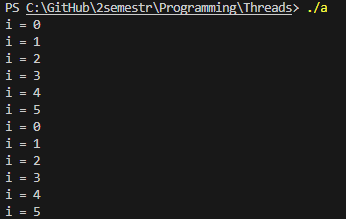
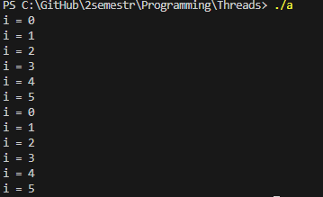
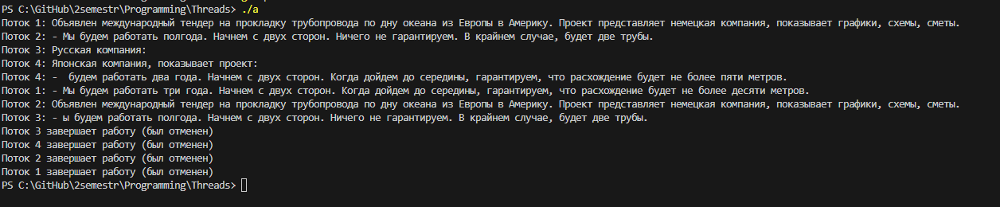
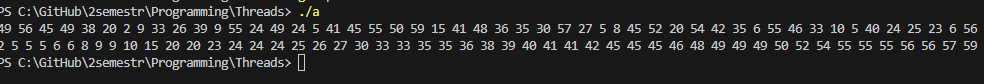
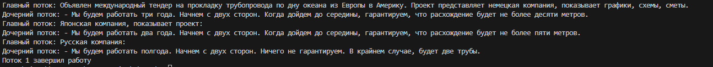
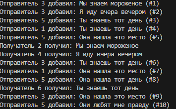

1.	Создать поток
```c
    #include <stdio.h>
    #include <stdlib.h>
    #include <pthread.h>
    #include <unistd.h>

    void* plus(){
        for(int i = 0;i <= 5;i++){
            printf("i = %d\n",i);
        }
        return NULL;
    }
    int main(){
        pthread_t tid;
        pthread_create(&tid, NULL, plus, NULL);
        for(int i = 0;i <= 5;i++){
            printf("i = %d\n",i);
        }
        sleep(1);
    }   
```


2.	Ожидание потока
```c

    #include <stdio.h>
    #include <stdlib.h>
    #include <pthread.h>
    #include <unistd.h>

    void* plus(){
        for(int i = 0;i <= 5;i++){
            printf("i = %d\n",i);
        }
        return NULL;
    }
    int main(){
        pthread_t tid;
        pthread_create(&tid, NULL, plus, NULL);
        pthread_join(tid,NULL);
        for(int i = 0;i <= 5;i++){
            printf("i = %d\n",i);
        }
    }   
```


3-5. 
```c
    #include <stdio.h>
    #include <stdlib.h>
    #include <pthread.h>
    #include <unistd.h>
    #include <string.h>

    typedef struct {
        char **messages;
        int start;
        int count;
    } ThreadData;

    void cleanup(void *arg) {
        printf("Поток %lu завершает работу (был отменен)\n", pthread_self());
    }

    void* plus(void *arg) { 

        pthread_setcancelstate(PTHREAD_CANCEL_ENABLE, NULL);
        ThreadData *data = (ThreadData*)arg;
        pthread_cleanup_push(cleanup, NULL);
        
        for(int i = 0; i < data->count; i++) {
            printf("Поток %lu: %s\n", pthread_self(), data->messages[data->start + i]);
            sleep(1);
            pthread_testcancel();
        }
        
        free(data);
        printf("Поток %lu завершил работу (нормально)\n", pthread_self());
        

        pthread_cleanup_pop(0);
        return NULL;
    }

    int main() {
        char* messages[] = {
            "Объявлен международный тендер на прокладку трубопровода по дну океана из Европы в Америку. Проект представляет немецкая компания, показывает графики, схемы, сметы.",
            "- Мы будем работать три года. Начнем с двух сторон. Когда дойдем до середины, гарантируем, что расхождение будет не более десяти метров.",
            "Японская компания, показывает проект:",
            "- Мы будем работать два года. Начнем с двух сторон. Когда дойдем до середины, гарантируем, что расхождение будет не более пяти метров.",
            "Русская компания:",
            "- Мы будем работать полгода. Начнем с двух сторон. Ничего не гарантируем. В крайнем случае, будет две трубы.",
            "Объявлен международный тендер на прокладку трубопровода по дну океана из Европы в Америку. Проект представляет немецкая компания, показывает графики, схемы, сметы.",
            "- ы будем работать три года. Начнем с двух сторон. Когда дойдем до середины, гарантируем, что расхождение будет не более десяти метров.",
            "Японская компания, показывает проект:",
            "- ы будем работать два года. Начнем с двух сторон. Когда дойдем до середины, гарантируем, что расхождение будет не более пяти метров.",
            "Русская компания:",
            "- ы будем работать полгода. Начнем с двух сторон. Ничего не гарантируем. В крайнем случае, будет две трубы.",
            "Объявлен международный тендер на прокладку трубопровода по дну океана из Европы в Америку. Проект представляет немецкая компания, показывает графики, схемы, сметы.",
            "-  будем работать три года. Начнем с двух сторон. Когда дойдем до середины, гарантируем, что расхождение будет не более десяти метров.",
            "Японская компания, показывает проект:",
            "-  будем работать два года. Начнем с двух сторон. Когда дойдем до середины, гарантируем, что расхождение будет не более пяти метров.",
            "Русская компания:",
            "-  будем работать полгода. Начнем с двух сторон. Ничего не гарантируем. В крайнем случае, будет две трубы.",
            NULL
        };


        int total_messages = 0;
        while(messages[total_messages] != NULL) total_messages++;

        pthread_t threads[4];
        int messages_per_thread = total_messages / 4;
        int remainder = total_messages % 4;
        int current_start = 0;

        for(int i = 0; i < 4; i++) {
            ThreadData *data = malloc(sizeof(ThreadData));
            data->messages = messages;
            data->start = current_start;
            
            data->count = messages_per_thread;
            if (i < remainder) data->count++; 
            
            pthread_create(&threads[i], NULL, plus, data);
            
            current_start += data->count;
        }
        sleep(2);
        for(int i = 0; i < 4; i++) {
            pthread_cancel(threads[i]);
        }
        for(int i = 0; i < 4; i++) {
            pthread_join(threads[i], NULL);
        }
        
    }   
    

```

6.	Реализовать простой Sleepsort


```c
#include <stdio.h>
#include <stdlib.h>
#include <pthread.h>
#include <unistd.h>
#include <string.h>
void printer(int* arr){
    for(int i = 0 ;i < 50; i++){
        printf("%d ",arr[i]);
        
    }
    printf("\n");
}
void* sorted(void *arg){
    int argi = *(int*)arg;
    sleep(argi);
    printf("%d ",argi);
    return NULL;
}
int main(){
    srand(time(NULL));
    pthread_t threads[50];
    int* a = malloc(sizeof(int)* 50);
    
    for(int i = 0 ; i < 50;i++){
        a[i] = rand() % 60;
    }
    printer(a);
    
    for(int i = 0;i < 50;i++){
        pthread_create(&threads[i],NULL,sorted,&a[i]);
    }
    for(int i = 0; i < 50; i++) {
        pthread_join(threads[i], NULL);
    }
}
```
7.	Синхронизированный вывод
```c
#include <stdio.h>
#include <stdlib.h>
#include <pthread.h>
#include <unistd.h>
#include <string.h>

int curstr = 0;
int turn = 0;
pthread_mutex_t mutex = PTHREAD_MUTEX_INITIALIZER;
pthread_cond_t cond = PTHREAD_COND_INITIALIZER;

void cleanup(void *arg) {
    printf("Поток %lu завершает работу (был отменен)\n", pthread_self());
}

void* plus(void *arg) {
    char **messages = (char**)arg;
    
    pthread_setcancelstate(PTHREAD_CANCEL_ENABLE, NULL);
    pthread_cleanup_push(cleanup, NULL);

    while(1) {
        pthread_mutex_lock(&mutex);
        
        while(turn != 1 && messages[curstr] != NULL) {
            pthread_cond_wait(&cond, &mutex);
        }
        
        if(messages[curstr] == NULL) {
            pthread_mutex_unlock(&mutex);
            break;
        }
        
        printf("Дочерний поток: %s\n", messages[curstr++]);
        turn = 0; // Передаем ход главному потоку
        pthread_cond_signal(&cond);
        
        pthread_mutex_unlock(&mutex);
    }

    printf("Поток %lu завершил работу\n", pthread_self());
    pthread_cleanup_pop(0);
    return NULL;
}

int main() {
    char* messages[] = {
        "Объявлен международный тендер на прокладку трубопровода по дну океана из Европы в Америку. Проект представляет немецкая компания, показывает графики, схемы, сметы.",
        "- Мы будем работать три года. Начнем с двух сторон. Когда дойдем до середины, гарантируем, что расхождение будет не более десяти метров.",
        "Японская компания, показывает проект:",
        "- Мы будем работать два года. Начнем с двух сторон. Когда дойдем до середины, гарантируем, что расхождение будет не более пяти метров.",
        "Русская компания:",
        "- Мы будем работать полгода. Начнем с двух сторон. Ничего не гарантируем. В крайнем случае, будет две трубы.",
        NULL
    };

    pthread_t thread;
    pthread_create(&thread, NULL, plus, messages);

    while(1) {
        pthread_mutex_lock(&mutex);
        
        
        while(turn != 0 && messages[curstr] != NULL) {
            pthread_cond_wait(&cond, &mutex);
        }
        
        if(messages[curstr] == NULL) {
            turn = 1;
            pthread_cond_signal(&cond);
            pthread_mutex_unlock(&mutex);
            break;
        }
        
        printf("Главный поток: %s\n", messages[curstr++]);
        turn = 1;
        pthread_cond_signal(&cond);
        
        pthread_mutex_unlock(&mutex);
    }

    pthread_join(thread, NULL);
    
    
    return 0;
}
```

8.	Перемножение квадратных матриц NxN
```c
#include <stdio.h>
#include <stdlib.h>
#include <pthread.h>
#include <time.h>
#include <sys/time.h>
#include <math.h>
#include <unistd.h>

#define MAX_THREADS 64
#define MAX_SIZE 500
#define STEP_SIZE 10
#define THREAD_STEP 2

typedef struct {
    double **A;
    double **B;
    double **C;
    int N;
    int start_row;
    int end_row;
} ThreadData;

void initialize_matrix(double **matrix, int N, int value) {
    for (int i = 0; i < N; i++) {
        for (int j = 0; j < N; j++) {
            matrix[i][j] = value;
        }
    }
}

void print_matrix(double **matrix, int N) {
    for (int i = 0; i < N; i++) {
        for (int j = 0; j < N; j++) {
            printf("%.0f ", matrix[i][j]);
        }
        printf("\n");
    }
    printf("\n");
}

void* multiply_part(void *arg) {
    ThreadData *data = (ThreadData*)arg;
    
    for (int i = data->start_row; i < data->end_row; i++) {
        for (int j = 0; j < data->N; j++) {
            data->C[i][j] = 0;
            for (int k = 0; k < data->N; k++) {
                data->C[i][j] += data->A[i][k] * data->B[k][j];
            }
        }
    }
    
    pthread_exit(NULL);
}

double get_time() {
    struct timeval tv;
    gettimeofday(&tv, NULL);
    return tv.tv_sec + tv.tv_usec * 1e-6;
}

void run_test(int N, int num_threads, FILE *results_file) {
    double **A = (double**)malloc(N * sizeof(double*));
    double **B = (double**)malloc(N * sizeof(double*));
    double **C = (double**)malloc(N * sizeof(double*));
    
    for (int i = 0; i < N; i++) {
        A[i] = (double*)malloc(N * sizeof(double));
        B[i] = (double*)malloc(N * sizeof(double));
        C[i] = (double*)malloc(N * sizeof(double));
    }

    initialize_matrix(A, N, 1);
    initialize_matrix(B, N, 1);

    pthread_t *threads = (pthread_t*)malloc(num_threads * sizeof(pthread_t));
    ThreadData *thread_data = (ThreadData*)malloc(num_threads * sizeof(ThreadData));

    int rows_per_thread = N / num_threads;
    int remaining_rows = N % num_threads;
    
    double start_time = get_time();

    int current_row = 0;
    for (int i = 0; i < num_threads; i++) {
        thread_data[i].A = A;
        thread_data[i].B = B;
        thread_data[i].C = C;
        thread_data[i].N = N;
        thread_data[i].start_row = current_row;
        
        int rows = rows_per_thread;
        if (i < remaining_rows) {
            rows++;
        }
        
        thread_data[i].end_row = current_row + rows;
        current_row += rows;
        
        pthread_create(&threads[i], NULL, multiply_part, &thread_data[i]);
    }

    for (int i = 0; i < num_threads; i++) {
        pthread_join(threads[i], NULL);
    }

    double end_time = get_time();
    double elapsed_time = (end_time - start_time) * 1000;

    fprintf(results_file, "%d,%d,%.2f\n", N, num_threads, elapsed_time);
    printf("N=%d, поток=%d, секунд=%.2f ms\n", N, num_threads, elapsed_time);

    for (int i = 0; i < N; i++) {
        free(A[i]);
        free(B[i]);
        free(C[i]);
    }
    free(A);
    free(B);
    free(C);
    free(threads);
    free(thread_data);
}

void generate_plot() {
    FILE *plot_script = fopen("plot_results.py", "w");
    if (!plot_script) {
        perror("Ошибка создания plot script");
        return;
    }

    fprintf(plot_script, "import pandas as pd\n");
    fprintf(plot_script, "import matplotlib.pyplot as plt\n");
    fprintf(plot_script, "import seaborn as sns\n\n");
    fprintf(plot_script, "df = pd.read_csv('results.csv', header=None, names=['Size', 'Threads', 'Time'])\n");
    fprintf(plot_script, "pivoted = df.pivot(index='Size', columns='Threads', values='Time')\n\n");
    fprintf(plot_script, "plt.figure(figsize=(12, 8))\n");
    fprintf(plot_script, "for column in pivoted.columns:\n");
    fprintf(plot_script, "    plt.plot(pivoted.index, pivoted[column], label=f'{column} Потоки', marker='o')\n\n");
    fprintf(plot_script, "plt.xlabel('Размер')\n");
    fprintf(plot_script, "plt.ylabel('Время (ms)')\n");
    fprintf(plot_script, "plt.title('Тестирование потоков')\n");
    fprintf(plot_script, "plt.legend()\n");
    fprintf(plot_script, "plt.grid(True)\n");
    fprintf(plot_script, "plt.savefig('performance_plot.png')\n");
    fprintf(plot_script, "plt.show()\n");
    fclose(plot_script);

    printf("Сохранено в 'performance_plot.png'\n");
}

int main() {
    printf("Тестирование...\n");
    
    FILE *results_file = fopen("results.csv", "w");
    if (!results_file) {
        perror("Ошибка создания results file");
        return 1;
    }


    for (int size = STEP_SIZE; size <= MAX_SIZE; size += STEP_SIZE) {
        for (int threads = 1; threads <= MAX_THREADS; threads *= THREAD_STEP) {
            run_test(size, threads, results_file);
        }
    }

    fclose(results_file);
    printf("\nСохранено в'results.csv'\n");

    generate_plot();

    return 0;
}
```

10.
```c
#include <stdio.h>
#include <stdlib.h>
#include <pthread.h>
#include <time.h>
#include <unistd.h>
#include <string.h>

pthread_mutex_t queue_mutex = PTHREAD_MUTEX_INITIALIZER;
pthread_mutex_t rand_mutex = PTHREAD_MUTEX_INITIALIZER;
pthread_mutex_t file_mutex = PTHREAD_MUTEX_INITIALIZER;
int ttl = 30;
int running = 1;

typedef struct ThreadData {
    char *message;
    struct ThreadData* next;
    int num;
} ThreadData;

typedef struct {
    ThreadData *head;
    ThreadData *tail;
} Queue;

Queue queue = {NULL, NULL};

void update_graph_file() {
    pthread_mutex_lock(&file_mutex);
    FILE *fp = fopen("graph.dot", "w");
    if (fp == NULL) {
        fprintf(stderr, "Ошибка открытия файла для записи!\n");
        pthread_mutex_unlock(&file_mutex);
        return;
    }
    
    fprintf(fp, "digraph LinkedList {\n");
    fprintf(fp, "node [shape=circle];\n");
    fprintf(fp, "rankdir=UD;\n");

    pthread_mutex_lock(&queue_mutex);
    ThreadData *current = queue.head;
    while (current != NULL) {
        char escaped_msg[256];
        int j = 0;
        for (int i = 0; current->message[i] != '\0' && j < 255; i++) {
            if (current->message[i] == '"' || current->message[i] == '\\') {
                escaped_msg[j++] = '\\';
            }
            escaped_msg[j++] = current->message[i];
        }
        escaped_msg[j] = '\0';
        
        fprintf(fp, "  node%d [label=\"%d: %s\"];\n", current->num, current->num, escaped_msg);
        if (current->next != NULL) {
            fprintf(fp, "  node%d -> node%d;\n", current->num, current->next->num);
        }
        current = current->next;
    }
    pthread_mutex_unlock(&queue_mutex);
    
    fprintf(fp, "}\n");
    fclose(fp);
    pthread_mutex_unlock(&file_mutex);
}

int safe_rand(int max) {
    pthread_mutex_lock(&rand_mutex);
    int result = rand() % max;
    pthread_mutex_unlock(&rand_mutex);
    return result;
}

unsigned int portable_rand_r(unsigned int *seed) {
    unsigned int next = *seed;
    next *= 1103515245;
    next += 12345;
    *seed = next;
    return (unsigned int)(next / 65536) % 32768;
}

char* get_message() {
    const char* first_part[] = {
        "Я иду", "Ты знаешь", "Мы видели", "Он сказал",
        "Она пришла", "Вы слышали", "Они любят", "Я хочу",
        "Мы можем", "Ты помнишь", "Он забыл", "Она нашла",
        "Вы видели", "Я сделал", "Мы знаем", "Ты понимаешь"
    };
    
    const char* second_part[] = {
        "домой", "это место", "вчера вечером", "мне правду",
        "совсем одна", "эту песню", "мороженое", "кофе",
        "завтра утром", "тот день", "свой пароль", "деньги",
        "этот фильм", "свою ошибку", "этого человека", "нас"
    };
    
    char* message = malloc(50);
    snprintf(message, 50, "%s %s", first_part[safe_rand(16)], second_part[safe_rand(16)]);
    
    return message;
}

void* sender_thread(void *arg) {
    unsigned int seed = time(NULL) ^ pthread_self();
    
    while(running) {
        int delay = 1 + (portable_rand_r(&seed) % 3);
        if(queue.tail != NULL){
            if(queue.tail->num > 10) delay += 10;}
        sleep(delay);
        
        char* msg = get_message();
        
        ThreadData* new_node = malloc(sizeof(ThreadData));
        if (!new_node) {
            printf("Ошибка выделения памяти\n");
            free(msg);
            continue;
        }
        new_node->next = NULL;
        new_node->message = msg;
        
        pthread_mutex_lock(&queue_mutex);
        
        if (queue.tail == NULL) {
            new_node->num = 1;
            queue.head = queue.tail = new_node;
        } else {
            new_node->num = queue.tail->num + 1;
            queue.tail->next = new_node;
            queue.tail = new_node;
        }
        
        pthread_mutex_unlock(&queue_mutex);
        
        printf("Отправитель %lu добавил: %s (#%d)\n", pthread_self()-1, msg, new_node->num);
        update_graph_file();
    }
    return NULL;
}

void* receiver_thread(void *arg) {
    unsigned int seed = time(NULL) ^ pthread_self();
    int bufsize = 128;
    char message[bufsize + 1];
    
    while(running) {
        int delay = 1 + (portable_rand_r(&seed) % 5);
        sleep(delay);
        
        pthread_mutex_lock(&queue_mutex);
        
        if (queue.head == NULL) {
            pthread_mutex_unlock(&queue_mutex);
            continue;
        }
        
        strncpy(message, queue.head->message, bufsize);
        message[bufsize] = '\0';
        
        ThreadData* curr = queue.head;
        queue.head = queue.head->next;
        if (queue.head == NULL) {
            queue.tail = NULL;
        }
        
        pthread_mutex_unlock(&queue_mutex);
        
        printf("Получатель %lu получил: %s\n", pthread_self()-1, message);
        if(strlen(curr->message) > bufsize) {
            printf("Сообщение обрезано\n");
        }
        
        free(curr->message);
        free(curr);
        update_graph_file();
    }
    return NULL;
}

void* code_break(void *arg) {
    sleep(*(int*)arg);
    running = 0;
    return NULL;
}

int main() {
    srand(time(NULL));
    pthread_t breaker;
    pthread_create(&breaker, NULL, code_break, &ttl);

    pthread_t senders[3], receivers[3];
    
    update_graph_file();
    
    for (int i = 0; i < 3; i++) {
        pthread_create(&senders[i], NULL, sender_thread, NULL);
        pthread_create(&receivers[i], NULL, receiver_thread, NULL);
        sleep(1);
    }
    
    for (int i = 0; i < 3; i++) {
        pthread_join(senders[i], NULL);
        pthread_join(receivers[i], NULL);
    }
    
    pthread_join(breaker, NULL);
    return 0;
} 
```

