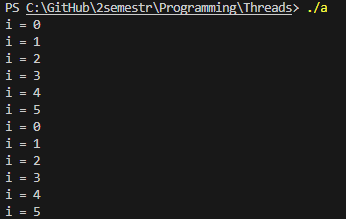
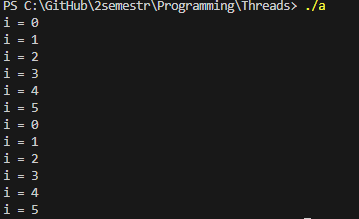
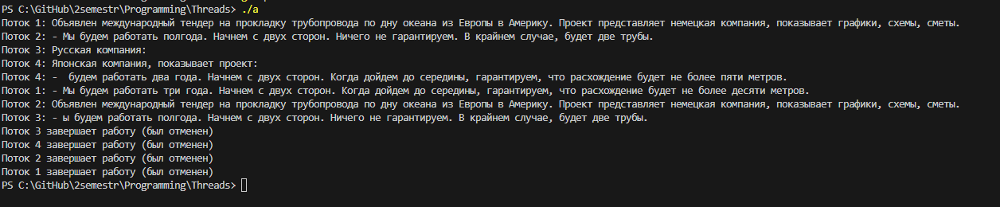
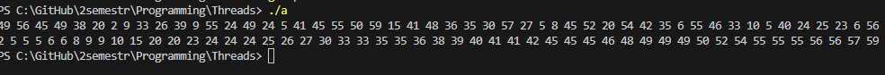
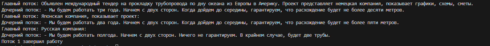

1.	Создать поток

    #include <stdio.h>
    #include <stdlib.h>
    #include <pthread.h>
    #include <unistd.h>

    void* plus(){
        for(int i = 0;i <= 5;i++){
            printf("i = %d\n",i);
        }
        return NULL;
    }
    int main(){
        pthread_t tid;
        pthread_create(&tid, NULL, plus, NULL);
        for(int i = 0;i <= 5;i++){
            printf("i = %d\n",i);
        }
        sleep(1);
    }   

2.	Ожидание потока

    #include <stdio.h>
    #include <stdlib.h>
    #include <pthread.h>
    #include <unistd.h>

    void* plus(){
        for(int i = 0;i <= 5;i++){
            printf("i = %d\n",i);
        }
        return NULL;
    }
    int main(){
        pthread_t tid;
        pthread_create(&tid, NULL, plus, NULL);
        pthread_join(tid,NULL);
        for(int i = 0;i <= 5;i++){
            printf("i = %d\n",i);
        }
    }   
    

3-5. 
    #include <stdio.h>
    #include <stdlib.h>
    #include <pthread.h>
    #include <unistd.h>
    #include <string.h>

    typedef struct {
        char **messages;
        int start;
        int count;
    } ThreadData;

    void cleanup(void *arg) {
        printf("Поток %lu завершает работу (был отменен)\n", pthread_self());
    }

    void* plus(void *arg) { 

        pthread_setcancelstate(PTHREAD_CANCEL_ENABLE, NULL);
        ThreadData *data = (ThreadData*)arg;
        pthread_cleanup_push(cleanup, NULL);
        
        for(int i = 0; i < data->count; i++) {
            printf("Поток %lu: %s\n", pthread_self(), data->messages[data->start + i]);
            sleep(1);
            pthread_testcancel();
        }
        
        free(data);
        printf("Поток %lu завершил работу (нормально)\n", pthread_self());
        

        pthread_cleanup_pop(0);
        return NULL;
    }

    int main() {
        char* messages[] = {
            "Объявлен международный тендер на прокладку трубопровода по дну океана из Европы в Америку. Проект представляет немецкая компания, показывает графики, схемы, сметы.",
            "- Мы будем работать три года. Начнем с двух сторон. Когда дойдем до середины, гарантируем, что расхождение будет не более десяти метров.",
            "Японская компания, показывает проект:",
            "- Мы будем работать два года. Начнем с двух сторон. Когда дойдем до середины, гарантируем, что расхождение будет не более пяти метров.",
            "Русская компания:",
            "- Мы будем работать полгода. Начнем с двух сторон. Ничего не гарантируем. В крайнем случае, будет две трубы.",
            "Объявлен международный тендер на прокладку трубопровода по дну океана из Европы в Америку. Проект представляет немецкая компания, показывает графики, схемы, сметы.",
            "- ы будем работать три года. Начнем с двух сторон. Когда дойдем до середины, гарантируем, что расхождение будет не более десяти метров.",
            "Японская компания, показывает проект:",
            "- ы будем работать два года. Начнем с двух сторон. Когда дойдем до середины, гарантируем, что расхождение будет не более пяти метров.",
            "Русская компания:",
            "- ы будем работать полгода. Начнем с двух сторон. Ничего не гарантируем. В крайнем случае, будет две трубы.",
            "Объявлен международный тендер на прокладку трубопровода по дну океана из Европы в Америку. Проект представляет немецкая компания, показывает графики, схемы, сметы.",
            "-  будем работать три года. Начнем с двух сторон. Когда дойдем до середины, гарантируем, что расхождение будет не более десяти метров.",
            "Японская компания, показывает проект:",
            "-  будем работать два года. Начнем с двух сторон. Когда дойдем до середины, гарантируем, что расхождение будет не более пяти метров.",
            "Русская компания:",
            "-  будем работать полгода. Начнем с двух сторон. Ничего не гарантируем. В крайнем случае, будет две трубы.",
            NULL
        };

        int total_messages = 0;
        while(messages[total_messages] != NULL) total_messages++;

        pthread_t threads[4];
        int messages_per_thread = total_messages / 4;
        int remainder = total_messages % 4;
        int current_start = 0;

        for(int i = 0; i < 4; i++) {
            ThreadData *data = malloc(sizeof(ThreadData));
            data->messages = messages;
            data->start = current_start;
            
            data->count = messages_per_thread;
            if (i < remainder) data->count++; 
            
            pthread_create(&threads[i], NULL, plus, data);
            
            current_start += data->count;
        }
        sleep(2);
        for(int i = 0; i < 4; i++) {
            pthread_cancel(threads[i]);
        }
        for(int i = 0; i < 4; i++) {
            pthread_join(threads[i], NULL);
        }
        
    }   
    

6.	Реализовать простой Sleepsort

#include <stdio.h>
#include <stdlib.h>
#include <pthread.h>
#include <unistd.h>
#include <string.h>
void printer(int* arr){
    for(int i = 0 ;i < 50; i++){
        printf("%d ",arr[i]);
        
    }
    printf("\n");
}
void* sorted(void *arg){
    int argi = *(int*)arg;
    sleep(argi);
    printf("%d ",argi);
    return NULL;
}
int main(){
    srand(time(NULL));
    pthread_t threads[50];
    int* a = malloc(sizeof(int)* 50);
    
    for(int i = 0 ; i < 50;i++){
        a[i] = rand() % 60;
    }
    printer(a);
    
    for(int i = 0;i < 50;i++){
        pthread_create(&threads[i],NULL,sorted,&a[i]);
    }
    for(int i = 0; i < 50; i++) {
        pthread_join(threads[i], NULL);
    }
}
7.	Синхронизированный вывод
#include <stdio.h>
#include <stdlib.h>
#include <pthread.h>
#include <unistd.h>
#include <string.h>

int curstr = 0;
int turn = 0;
pthread_mutex_t mutex = PTHREAD_MUTEX_INITIALIZER;
pthread_cond_t cond = PTHREAD_COND_INITIALIZER;

void cleanup(void *arg) {
    printf("Поток %lu завершает работу (был отменен)\n", pthread_self());
}

void* plus(void *arg) {
    char **messages = (char**)arg;
    
    pthread_setcancelstate(PTHREAD_CANCEL_ENABLE, NULL);
    pthread_cleanup_push(cleanup, NULL);

    while(1) {
        pthread_mutex_lock(&mutex);
        
        while(turn != 1 && messages[curstr] != NULL) {
            pthread_cond_wait(&cond, &mutex);
        }
        
        if(messages[curstr] == NULL) {
            pthread_mutex_unlock(&mutex);
            break;
        }
        
        printf("Дочерний поток: %s\n", messages[curstr++]);
        turn = 0; // Передаем ход главному потоку
        pthread_cond_signal(&cond);
        
        pthread_mutex_unlock(&mutex);
    }

    printf("Поток %lu завершил работу\n", pthread_self());
    pthread_cleanup_pop(0);
    return NULL;
}

int main() {
    char* messages[] = {
        "Объявлен международный тендер на прокладку трубопровода по дну океана из Европы в Америку. Проект представляет немецкая компания, показывает графики, схемы, сметы.",
        "- Мы будем работать три года. Начнем с двух сторон. Когда дойдем до середины, гарантируем, что расхождение будет не более десяти метров.",
        "Японская компания, показывает проект:",
        "- Мы будем работать два года. Начнем с двух сторон. Когда дойдем до середины, гарантируем, что расхождение будет не более пяти метров.",
        "Русская компания:",
        "- Мы будем работать полгода. Начнем с двух сторон. Ничего не гарантируем. В крайнем случае, будет две трубы.",
        NULL
    };

    pthread_t thread;
    pthread_create(&thread, NULL, plus, messages);

    while(1) {
        pthread_mutex_lock(&mutex);
        
        
        while(turn != 0 && messages[curstr] != NULL) {
            pthread_cond_wait(&cond, &mutex);
        }
        
        if(messages[curstr] == NULL) {
            turn = 1;
            pthread_cond_signal(&cond);
            pthread_mutex_unlock(&mutex);
            break;
        }
        
        printf("Главный поток: %s\n", messages[curstr++]);
        turn = 1;
        pthread_cond_signal(&cond);
        
        pthread_mutex_unlock(&mutex);
    }

    pthread_join(thread, NULL);
    
    
    return 0;
}

8.	Перемножение квадратных матриц NxN

