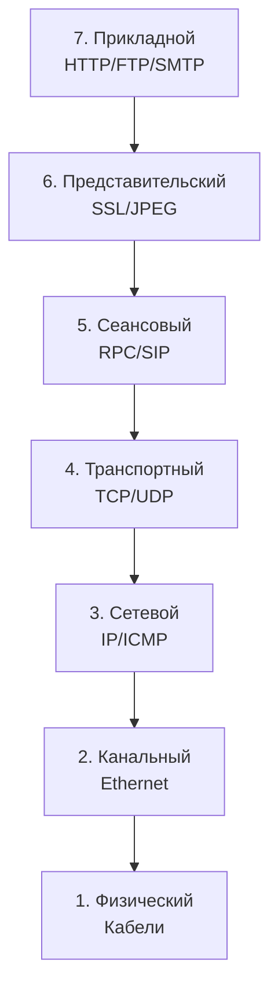

# 🌐 Web Development Journey


**Репозиторий с материалами по изучению современных web-технологий.**  
От основ сетей до продвинутых фреймворков и дизайн-инструментов.

## 🛠️ Технологический стек

<p align="center">
  
  
  
  
  
</p>

## 🚀 Быстрый старт

### Установка зависимостей
```bash
# Для Django-проекта
cd django-app
pip install -r requirements.txt

# Для Flask-проекта
cd flask-api
pip install flask flask-sqlalchemy
python manage.py runserver

# Flask
flask run --debug
```

### 2. Модель OSI

📚 Полезные ресурсы
-  [Django Docs](https://docs.djangoproject.com)
-  [Flask Guide](https://flask.palletsprojects.com)

🎯 Roadmap
- Основы HTTP/HTTPS
- Создание первого Django-приложения
- Реализация аутентификации в Flask
- Адаптивный дизайн в Figma
- Деплой на AWS/GCP
